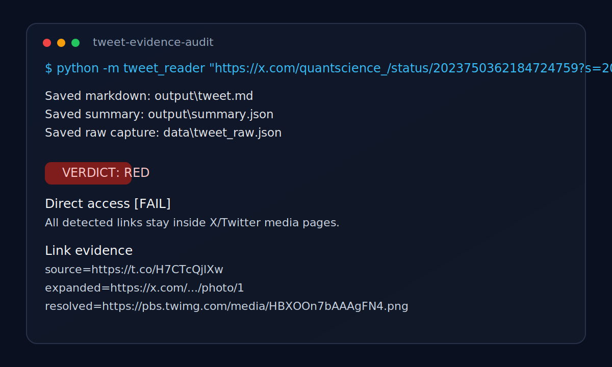

# Tweet Evidence Audit CLI

[](https://github.com/EmreUludasdemir/Finansal-Analist/actions/workflows/tests.yml)
[](https://www.python.org/)
[](LICENSE)

`tweet_reader` captures publicly retrievable tweet content from X/Twitter and turns it into a small evidence audit package.



The tool is built for due diligence style work:

- fetches public tweet metadata without authentication when possible
- preserves raw capture for reproducibility
- extracts clean text and thread items
- resolves link evidence
- produces a structured `red / yellow / green` audit verdict

It does **not** bypass login requirements, paywalls, or platform access controls.

The repo now includes:

- `pyproject.toml` package metadata
- GitHub Actions test workflow
- checked-in example reports
- ready-to-use GitHub and LinkedIn share copy
- reproducible example refresh script

## Why this is worth sharing on GitHub

This is stronger than a one-off notebook or screenshot dump because it shows:

- practical Python CLI work
- public-web data collection with fallbacks
- structured parsing and normalization
- evidence-based risk analysis instead of opinion-only commentary
- tests and deterministic fixtures

If you want a portfolio repo that signals OSINT, due diligence, or research engineering ability, this is a reasonable format.

## Quick start

```bash
pip install -r requirements.txt
python -m tweet_reader "https://x.com/<handle>/status/<id>"
```

Open:

- `output/tweet.md`
- `output/summary.json`

## Project layout

```text
tweet_reader/
  cli.py          # command entrypoint
  fetch.py        # public retrieval + link resolution
  parse.py        # URL validation and payload parsing
  summarize.py    # claims + evidence audit JSON
  render.py       # markdown report
tests/
  fixtures/       # offline samples for deterministic tests
data/             # manual paste fallback input
output/           # generated reports
```

## Requirements

- Python 3.10+

## Setup

```bash
python -m venv .venv
# Windows PowerShell
.venv\Scripts\Activate.ps1
# macOS/Linux
source .venv/bin/activate
pip install -r requirements.txt
```

You can also install it as a local package:

```bash
pip install -e .
tweet-evidence-audit "https://x.com/<handle>/status/<id>"
```

## Usage

```bash
python -m tweet_reader "https://x.com/<handle>/status/<id>"
```

Accepted URLs are public `x.com` or `twitter.com` status links.

Refresh the checked-in example package:

```bash
powershell -ExecutionPolicy Bypass -File scripts/refresh_examples.ps1
```

## Retrieval strategy

The CLI uses this order:

1. Public syndication endpoint for structured tweet metadata.
2. Official public oEmbed endpoint.
3. Direct HTML fetch with best-effort extraction.
4. Manual paste fallback from `data/tweet_paste.txt`.

If the public result is incomplete or blocked, the CLI asks for manual paste mode and exits with code `3`.

## Output files

The tool writes:

- `data/tweet_raw.json` or `data/tweet_raw.html`
- `output/tweet.md`
- `output/summary.json`

`summary.json` includes:

- `key_claims`
- `what_is_verifiable_vs_assumption`
- `evidence_audit`
- `suggested_checks`

The `evidence_audit` block contains:

- `verdict`: `green`, `yellow`, or `red`
- `summary`: one-paragraph explanation
- `checks`: direct access, transparency, verifiability, and CTA/intent signals
- `links`: resolved link evidence with content type when available

## Manual fallback

Create `data/tweet_paste.txt` with the tweet or thread text, then rerun.

Optional metadata lines at the top:

```text
Author: Jane Doe
Handle: @janedoe
Timestamp: January 1, 2026
```

After that header block, paste the tweet or thread body.

## Example use case

This repo is useful when a post makes a claim like:

```text
Get it here (361 page PDF): https://t.co/example
```

The audit can help answer:

- does the link resolve to a real external document or only tweet media?
- can a reviewer inspect the source directly from the post?
- is the post easy to verify, partially verifiable, or effectively opaque?

See checked-in sample outputs:

- `examples/quantscience_red_report.md`
- `examples/quantscience_red_summary.json`

## Exit codes

- `0`: success
- `2`: invalid usage or URL
- `3`: manual fallback required but paste file missing or empty
- `4`: unexpected runtime error

## Testing

```bash
python -m unittest discover -s tests -p "test_*.py"
```

## Contributing

See `CONTRIBUTING.md` for local workflow and constraints.

## Next upgrades

High-value next steps if you want to keep growing this repo:

1. add one or two more real-world example cases
2. support batch auditing from a CSV input list
3. add optional SQLite export for audit history
4. add richer thread-level extraction and multi-link scoring
